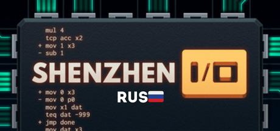

  
  
  # SHENZHEN-I-O-rus

  **перевод на русский язык для SHENZHEN I/**

 

### Что готово: 
- ✅ Перевод сообщений
- ⛔️ Перевод описаний
- ⛔️ Перевод текста

### Перевод даташита взят у [spok176](https://github.com/spok176/SHENZHEN-I-O-RUS) (Будет дополняться)

# Установка

Чтобы поставить руссификатор надо скопировать содержимое папки `shenzhen rus` в папку игры `SHENZHEN IO/Content/` и заменить содержимое.

Для перевода нужно поставить `английский язык` в настройках игры (**будет измененно на китайский**)

ДАТАШИТ ИЗМЕНЕН ПРИ `КИТАЙСКИЙ ЯЗЫК` В НАСТРОЙКАХ ИГРЫ

# связь

- ✈️ [Telegram](https://t.me/G0golMogol) — author's personal telegram
- 🖼 [Telegram channel](https://t.me/fancy_kuve) — telegram channel where the bot operateswork
- 📹 [YouTube](https://www.youtube.com/@kuve.) — YouTube channel with the author's projects